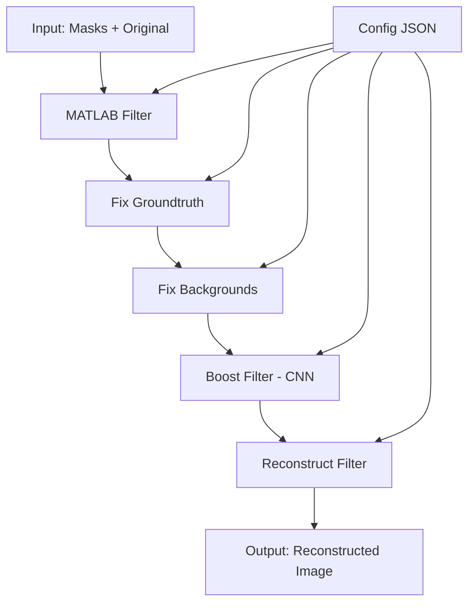

# Frame Pipeline

Il **Frame Pipeline** è un sistema completo per la ricostruzione automatica di immagini frammentate (jigsaw puzzle). Il sistema utilizza:

- **Reti Neurali Convoluzionali (CNN)** per l'analisi dei frammenti
- **Algoritmi di allineamento avanzati** per il matching dei pezzi
- **Pipeline modulare** con filtri intercambiabili
- **Supporto per job multipli** con possibilità di ripresa

### Architettura High-Level

```
Input: Frammenti + Immagine Originale
         ↓
[MATLAB Filter] → Generazione esempi
         ↓
[Fix Groundtruth] → Correzione dati verità
         ↓
[Fix Backgrounds] → Normalizzazione sfondi
         ↓
[Boost Filter] → Elaborazione CNN
         ↓
[Reconstruct] → Ricostruzione finale
         ↓
Output: Immagine Ricostruita
```

## Caratteristiche

- **CNN Multi-Learner**: Ensemble di 5 reti neurali per maggiore accuratezza
- **Pipeline Modulare**: Filtri intercambiabili e configurabili
- **Gestione Job**: Salvataggio automatico e ripresa dell'elaborazione
- **Configurazione Flessibile**: Parametri personalizzabili via JSON
- **Python 3.7+**: Compatibilità garantita con TensorFlow 1.15
- **Testing Completo**: Suite di test per ogni componente
- **Logging Dettagliato**: Monitoraggio completo del processo

## Prerequisiti

### Sistema Operativo
- **Linux** (testato su Ubuntu 18.04+)
- **Windows** (tramite WSL - Windows Subsystem for Linux)

### Software Richiesto
- **Python 3.7.9** (versione specifica richiesta)
- **MATLAB** (per il primo filtro della pipeline)
- **PowerShell** (per automazione job MATLAB su Windows)
- **Git** (per il download del repository)

### Hardware Consigliato
- **RAM**: Minimo 8GB, consigliato 16GB+
- **Storage**: Minimo 10GB liberi per modelli e dati temporanei
- **GPU**: Opzionale ma consigliata per accelerazione CNN

## Installazione

### 1. Clone del Repository

```bash
git clone <repository-url>
cd frame_pipeline
```

### 2. Setup Ambiente Python

#### Opzione A: Virtual Environment (Consigliato)
```bash
python3.7 -m venv venv
source venv/bin/activate
pip install --upgrade pip
pip install -r requirements.txt
```

#### Opzione B: Conda Environment
```bash
conda create -n frame_pipeline python=3.7.9
conda activate frame_pipeline
pip install -r requirements.txt
```

### 3. Configurazione Ambiente

Crea il file `.env` nella root del progetto:

```bash
cp .env.example .env
# Edita .env con i tuoi percorsi specifici
```

**Esempio file `.env`:**
```env
# Directory principale per i job
PIPELINE_JOBS_DIR=/mnt/c/Users/user/Documenti/Reassembly2d_Sources/jobs

# Configurazione predefinita (opzionale)
PIPELINE_DEFAULT_CONFIG=/path/to/default_config.json

# MATLAB (se necessario)
MATLAB_PATH=/usr/local/MATLAB/R2020b/bin/matlab

# PowerShell MATLAB automation (Windows)
MATLAB_WATCH_PATH=C:\Users\user\Documents\Reassembly2d_Sources\jobs
```

### 4. Preparazione Modelli CNN

I modelli pre-addestrati si trovano nella directory `model/`:

```bash
# Verifica che i modelli siano presenti
ls -la model/g*/
```

Ogni directory `g0` attraverso `g4` deve contenere:
- Checkpoint files (`.data`, `.index`, `.meta`)
- File `alpha.txt` e `data_weight.txt`

### 5. Verifica Installazione

```bash
# Test rapido del sistema
./run_pipeline.py --help

# Test completo dei filtri
python3.7 test_boost.py all
```

### 6. Automazione MATLAB (Windows/PowerShell)

Per sistemi Windows, è disponibile uno script PowerShell per l'automazione dei job MATLAB:

#### Setup PowerShell MATLAB Monitor
```powershell
# Avvia il monitor dei job MATLAB
.\matlab_pipeline.ps1 -WatchPath "C:\path\to\jobs"

# Test su job specifico
.\matlab_pipeline.ps1 -TestJobPath "C:\path\to\specific\job"
```

#### Caratteristiche dello Script PowerShell
- **Monitoraggio automatico**: Rileva nuovi job nella directory specificata
- **Esecuzione MATLAB**: Esegue automaticamente gli step 1 e 2 di MATLAB
- **Logging completo**: Salva log dettagliati per ogni esecuzione
- **Gestione errori**: Timeout e recovery automatici
- **Test mode**: Possibilità di testare su job specifici

#### Parametri Script PowerShell
| Parametro | Descrizione | Esempio |
|-----------|-------------|----------|
| `-WatchPath` | Directory da monitorare per nuovi job | `-WatchPath "C:\jobs"` |
| `-TestJobPath` | Job specifico da testare | `-TestJobPath "C:\jobs\job_20231103_150644"` |

#### Log e Monitoraggio
Lo script PowerShell genera automaticamente:
- `matlab_execution_step1.log` - Log dell'esecuzione step 1
- `matlab_execution_step2.log` - Log dell'esecuzione step 2  
- `job_result.json` - Risultato complessivo del job
- `matlab_pipeline.pid` - PID del processo monitor

#### Controllo del Monitor
```powershell
# Fermare il monitor
echo "stop" > stop_matlab_pipeline

# Verificare se è in esecuzione
Get-Process | Where-Object {$_.Name -eq "powershell"}
```

## Uso

### Utilizzo Base

#### Nuovo Job
```bash
./run_pipeline.py ./path/to/masks/ ./path/to/original.jpg "1:9"
```

#### Con Configurazione Personalizzata
```bash
./run_pipeline.py ./masks/ ./orig.jpg "1:9" ./custom_config.json
```

#### Ripresa Job Esistente
```bash
./run_pipeline.py -j /path/to/existing/job_folder
```

### Parametri

| Parametro | Descrizione | Obbligatorio |
|-----------|-------------|--------------|
| `masks_folder` | Directory contenente i frammenti | Sì (nuovo job) |
| `original_image` | Immagine originale di riferimento | Sì (nuovo job) |
| `parts` | Range pezzi (es: "1:9", "1:20") | Sì (nuovo job) |
| `config_file` | File configurazione JSON | No |
| `-j, --job-folder` | Directory job esistente | No |

### Esempi d'Uso

#### Esempio 1: Puzzle 3x3 (9 pezzi)
```bash
./run_pipeline.py \
  ./examples/puzzle_3x3/masks/ \
  ./examples/puzzle_3x3/original.jpg \
  "1:9"
```

#### Esempio 2: Puzzle 4x5 con configurazione custom
```bash
./run_pipeline.py \
  ./data/masks_20pieces/ \
  ./data/original_image.jpg \
  "1:20" \
  ./configs/high_precision.json
```

#### Esempio 3: Ripresa job interrotto
```bash
./run_pipeline.py -j /jobs/job_20231103_150644
```

#### Esempio 4: Ambiente Misto (Linux + Windows)
Su sistemi con MATLAB su Windows e pipeline Python su Linux:

**Step 1 - Avvia monitor MATLAB su Windows:**
```powershell
# Su Windows - Avvia PowerShell come amministratore
.\matlab_pipeline.ps1 -WatchPath "C:\Users\user\Documents\jobs"
```

**Step 2 - Esegui pipeline Python su Linux:**
```bash
# Su Linux/WSL
./run_pipeline.py ./masks/ ./orig.jpg "1:9"
# Il job viene creato e automaticamente rilevato dal monitor MATLAB
```

**Step 3 - La pipeline continua automaticamente:**
- Il monitor PowerShell rileva il nuovo job
- Esegue automaticamente gli step MATLAB (1-2)
- La pipeline Python riprende con i filtri rimanenti (3-6)

### Gestione dei Job

Ogni job crea una struttura directory come:

```
job_YYYYMMDD_HHMMSS/
├── input/
│   ├── masks/          # Frammenti copiati
│   ├── original.jpg    # Immagine originale
│   └── params.json     # Parametri job
├── output/
│   ├── step1_generate_new_example/
│   ├── step2_export_alignments/
│   ├── step3_fix_groundtruth/
│   ├── step4_fix_images/
│   ├── step5_boost/
│   └── step6_reconstruct/
└── logs/               # Log di esecuzione
```

## Architettura del Sistema

### Componenti Principali

#### 1. Pipeline Engine (`lib/pipeline/pipeline.py`)
- Orchestrazione dell'intero processo
- Gestione job e directory di lavoro
- Configurazione parametri

#### 2. Filter Framework (`lib/pipeline/filters/`)
- **MatlabFilter**: Preprocessing con MATLAB
- **FixGroundtruthFilter**: Correzione dati di verità
- **FixImageBackgroundsFilter**: Normalizzazione sfondi
- **BoostFilter**: Elaborazione CNN principale
- **ReconstructFilter**: Ricostruzione finale

#### 3. CNN Architecture (`lib/jigsawnet_arbitrarynet_roi.py`)
- Rete neurale per allineamento pezzi
- Architettura multi-learner (ensemble)
- Supporto TensorFlow 1.15

#### 4. Utilities (`lib/utils/`)
- Gestione immagini e maschere
- Conversioni formato
- Strumenti di processing

### Flusso di Dati



## Configurazione

### File di Configurazione

Il sistema usa file JSON per la configurazione. Usa il template fornito:

```bash
cp config_template.json my_config.json
```

### Parametri Principali

#### Configurazione Base
```json
{
  "bg_color": "255 255 255",
  "bg_tolerance": 0,
  "parts": "1:9",
  "top_k": 10
}
```

#### Hyperparameters CNN
```json
{
  "hyperparameters": {
    "width": 160,
    "height": 160,
    "depth": 3,
    "batch_size": 64,
    "learning_rate": 1e-4,
    "total_training_step": 30000,
    "learner_num": 5
  }
}
```

#### Opzioni Avanzate
```json
{
  "load_options": {
    "is_smooth_before_grad": false,
    "reduce_poly_length_to": 0.2
  },
  "dis_options": {
    "sampling_res": 4,
    "small_ov_percentage": 0.05
  }
}
```

Per documentazione completa vedi: [CONFIG_DOCUMENTATION.md](CONFIG_DOCUMENTATION.md)

## Pipeline dei Filtri

### 1. MatlabFilter
- **Scopo**: Preprocessing iniziale dei frammenti
- **Input**: Maschere raw + immagine originale
- **Output**: Dati preprocessati per CNN
- **Dipendenze**: MATLAB Runtime
- **Automazione**: Su Windows, disponibile script PowerShell per esecuzione automatica
  - **Step 1**: `generate_new_example` - Generazione esempi di training
  - **Step 2**: `export_alignments` - Esportazione allineamenti
  - **Monitoraggio**: Rilevamento automatico nuovi job e esecuzione
  - **Logging**: Log dettagliati per ogni step con gestione errori

### 2. FixGroundtruthFilter
- **Scopo**: Correzione dati ground truth
- **Input**: Output MATLAB
- **Output**: Ground truth corretto
- **Algoritmi**: Validazione posizioni, correzione errori

### 3. FixImageBackgroundsFilter
- **Scopo**: Normalizzazione sfondi
- **Input**: Immagini con sfondi inconsistenti
- **Output**: Immagini normalizzate
- **Algoritmi**: Rimozione background, standardizzazione

### 4. BoostFilter
- **Scopo**: Elaborazione CNN principale
- **Input**: Dati normalizzati
- **Output**: Predizioni allineamento
- **CNN**: Ensemble di 5 reti neurali
- **Modelli**: Pre-addestrati in `model/g0-g4/`

### 5. ReconstructFilter
- **Scopo**: Ricostruzione finale
- **Input**: Predizioni CNN
- **Output**: Immagine ricostruita
- **Algoritmi**: GlobalReassembly binary

## Testing

### Test Suite Completa

```bash
# Test di tutti i filtri
python3.7 test_boost.py all

# Test specifici
python3.7 test_boost.py boost
python3.7 test_boost.py matlab
python3.7 test_boost.py reconstruct
```

### Test Individuali

#### Test Boost Filter (CNN)
```bash
python3.7 test_boost.py boost
```

#### Test con Job Esistente
```bash
python3.7 test_boost.py boost -j /path/to/job
```

#### Test Performance
```bash
python3.7 test_boost.py performance
```

### Struttura Test

I test creano automaticamente:
- Dati mock per sviluppo
- Job temporanei per test
- Validazione output
- Cleanup automatico

## Risoluzione Problemi

### Problemi Comuni

#### 1. Errori di Import
```bash
# Se PIL non è disponibile
pip install Pillow

# Se TensorFlow ha problemi
pip install tensorflow==1.15.5
```

#### 2. Problemi Checkpoint
```bash
# Verifica modelli CNN
ls -la model/g*/checkpoint

# Se i path sono sbagliati, modifica i checkpoint files
sed -i 's|C:\\|./|g' model/g*/checkpoint
```

#### 3. Errori MATLAB
```bash
# Verifica installazione MATLAB
which matlab

# Configura path in .env
echo "MATLAB_PATH=/usr/local/MATLAB/R2020b/bin/matlab" >> .env
```

#### 4. Problemi Permessi
```bash
# Rendi eseguibile il binario
chmod +x bin/GlobalReassembly

# Rendi eseguibili gli script
chmod +x run_pipeline.py test_boost.py
```

#### 5. Problemi PowerShell/MATLAB (Windows)
```powershell
# Verifica esecuzione PowerShell
Get-ExecutionPolicy
# Se Restricted, cambia policy:
Set-ExecutionPolicy -ExecutionPolicy RemoteSigned -Scope CurrentUser

# Test connessione MATLAB
matlab -batch "disp('MATLAB OK'); exit"

# Verifica permessi directory jobs
Test-Path "C:\path\to\jobs" -PathType Container

# Debug monitor PowerShell
.\matlab_pipeline.ps1 -TestJobPath "C:\path\to\test\job" -Verbose
```

**Errori Comuni PowerShell:**
- **"Execution of scripts is disabled"**: Cambiare ExecutionPolicy
- **"MATLAB not found"**: Aggiungere MATLAB al PATH di sistema
- **"Access denied"**: Eseguire PowerShell come amministratore
- **"Job timeout"**: Verificare che i file di input siano completi
- **"Path not found"**: Usare path assoluti Windows (es: `C:\Users\...`)

### Debug Mode

Per debug dettagliato:

```bash
# Con logging verbose
PYTHONPATH=. python3.7 -v run_pipeline.py ./masks/ ./orig.jpg "1:9"

# Con profiling
python3.7 -m cProfile run_pipeline.py ./masks/ ./orig.jpg "1:9"
```

### Log Files

I log si trovano in:
- `job_folder/logs/` - Log specifici del job
- Console output - Log runtime in tempo reale
- **PowerShell logs** (Windows):
  - `matlab_execution_step1.log` - Log MATLAB step 1
  - `matlab_execution_step2.log` - Log MATLAB step 2
  - `job_result.json` - Risultato completo job MATLAB
  - `matlab_pipeline.pid` - PID del processo monitor

## Performance e Ottimizzazioni

### Hardware Requirements

| Configurazione | RAM | Storage | Tempo (9 pezzi) |
|----------------|-----|---------|------------------|
| Minima | 8GB | 10GB | ~30 min |
| Consigliata | 16GB | 20GB | ~15 min |
| Ottimale | 32GB | 50GB | ~10 min |

### Ottimizzazioni CNN

#### Per Velocità
```json
{
  "hyperparameters": {
    "batch_size": 32,
    "learner_num": 3,
    "total_training_step": 15000
  }
}
```

#### Per Qualità
```json
{
  "hyperparameters": {
    "batch_size": 16,
    "learner_num": 7,
    "total_training_step": 50000
  }
}
```

## Contribuire

### Development Setup

1. Fork del repository
2. Crea branch feature: `git checkout -b feature/nuova-funzionalita`
3. Commit changes: `git commit -am 'Aggiunge nuova funzionalità'`
4. Push branch: `git push origin feature/nuova-funzionalita`
5. Crea Pull Request

### Coding Standards

- **Python**: PEP 8, type hints dove possibile
- **Testing**: Test per ogni nuovo filtro/funzionalità
- **Documentation**: Docstring per tutte le funzioni pubbliche
- **Versioning**: Semantic versioning (MAJOR.MINOR.PATCH)

### Architettura Estensioni

Per aggiungere un nuovo filtro:

```python
from lib.pipeline.filters.base_filter import BaseFilter

class MyCustomFilter(BaseFilter):
    def process(self):
        # Logica del filtro
        return True
```

## Licenza

Questo progetto è distribuito sotto licenza MIT. Vedi il file [LICENSE](LICENSE) per dettagli completi.

---

## Supporto

Per problemi, bug reports o richieste di funzionalità:

1. Controlla la [documentazione](README.md)
2. Cerca negli [issues esistenti](../../issues)
3. Crea un nuovo issue con:
   - Descrizione dettagliata del problema
   - Steps per riprodurre
   - Log di errore completi
   - Configurazione sistema