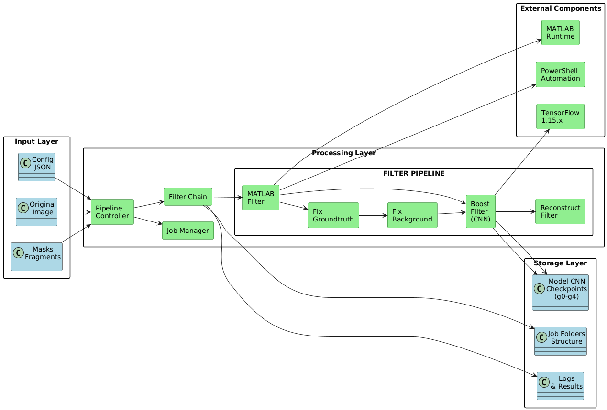
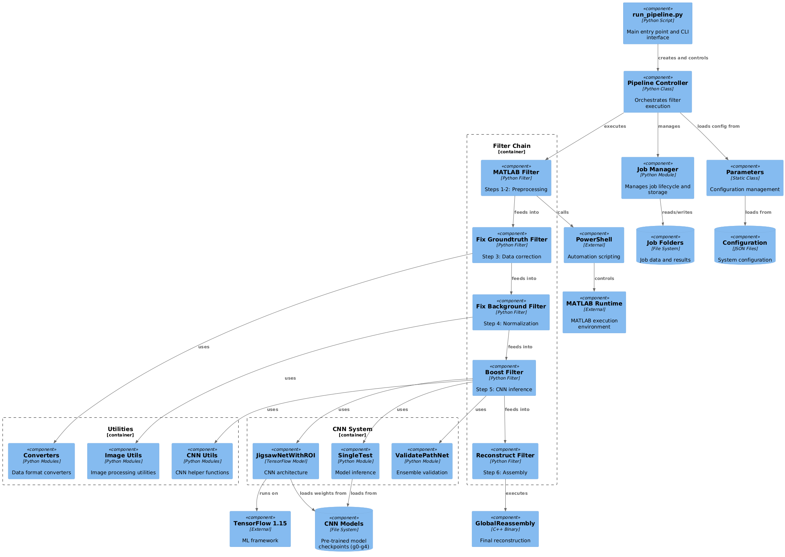
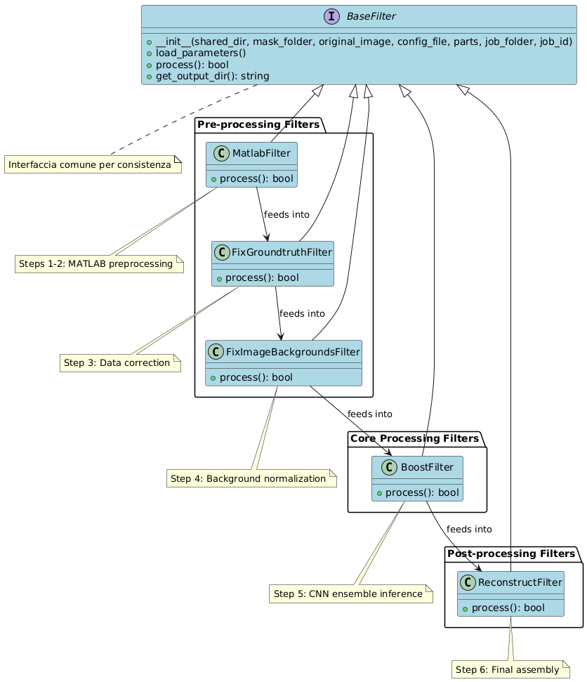
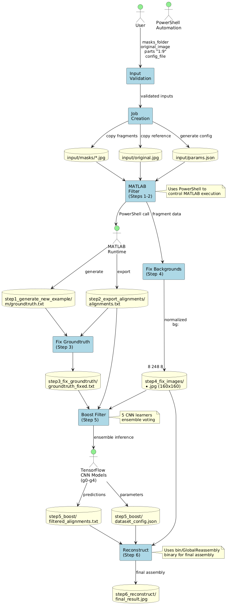
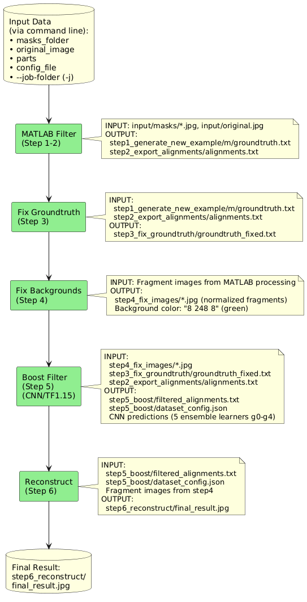
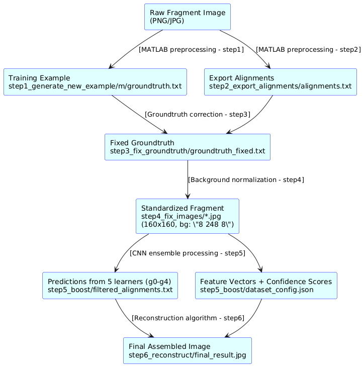
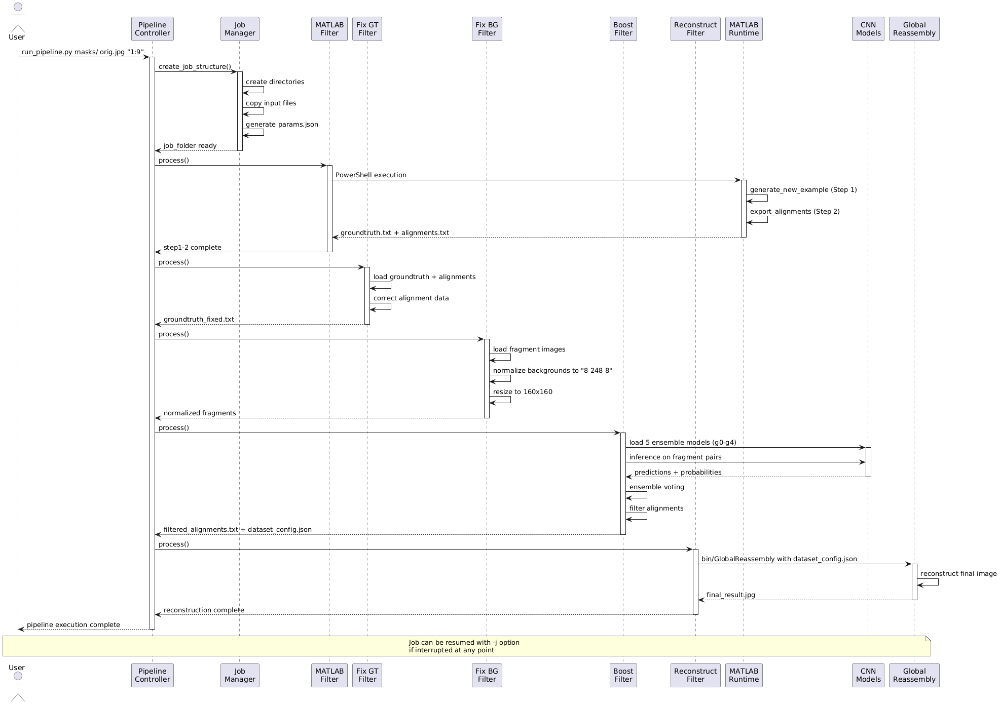
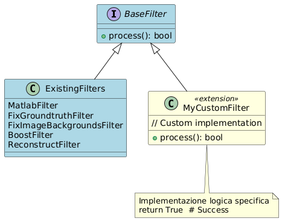

# Frame Pipeline - Architettura e Panoramica Tecnica

## Architettura High-Level

### Panoramica del Sistema

> **Diagrammi**: 
> - PlantUML: [high_level_architetture.puml](diagrams/high_level_architetture.puml)
> - Immagine: 

```
┌─────────────────────────────────────────────────────────────────┐
│                    FRAME PIPELINE SYSTEM                        │
├─────────────────────────────────────────────────────────────────┤
│                                                                 │
│  Input Layer                                                    │
│  ┌─────────────┐    ┌─────────────┐    ┌─────────────┐          │
│  │   Masks     │    │  Original   │    │   Config    │          │
│  │  Fragments  │    │   Image     │    │    JSON     │          │
│  └─────────────┘    └─────────────┘    └─────────────┘          │
│           │               │                    │                │
│           └───────────────┼────────────────────┘                │
│                           │                                     │
│  Processing Layer         │                                     │
│  ┌────────────────────────┼─────────────────────────────────┐   │
│  │                        │                                 │   │
│  │  ┌───────────────┐    ┌▼──────────────┐                  │   │
│  │  │  Job Manager  │◄───┤  Pipeline     │                  │   │
│  │  │               │    │  Controller   │                  │   │
│  │  └───────────────┘    └───────────────┘                  │   │
│  │                                │                         │   │
│  │                        ┌───────▼───────┐                 │   │
│  │                        │ Filter Chain  │                 │   │
│  │                        └───────────────┘                 │   │
│  │                                │                         │   │
│  │  ┌─────────────────────────────┼──────────────────────┐  │   │
│  │  │         FILTER PIPELINE     │                      │  │   │
│  │  │                             │                      │  │   │
│  │  │  ┌──────────┐   ┌──────────┐│   ┌────────────┐     │  │   │
│  │  │  │ MATLAB   │──►│   Fix    ││──►│   Fix      │     │  │   │
│  │  │  │ Filter   │   │Groundtruth│   │ Background │     │  │   │
│  │  │  └──────────┘   └──────────┘│   └────────────┘     │  │   │
│  │  │       │                     │        │             │  │   │
│  │  │       │        ┌──────────┐ │   ┌────▼──────┐      │  │   │
│  │  │       └───────►│  Boost   │─┼──►│Reconstruct│      │  │   │
│  │  │                │ Filter   │ │   │  Filter   │      │  │   │
│  │  │                │  (CNN)   │ │   └───────────┘      │  │   │
│  │  │                └──────────┘ │                      │  │   │
│  │  └─────────────────────────────┼──────────────────────┘  │   │
│  └────────────────────────────────┼─────────────────────────┘   │
│                                   │                             │
│  Storage Layer                    │                             │ 
│  ┌────────────────────────────────┼──────────────────────────┐  │
│  │                                │                          │  │
│  │  ┌──────────────┐    ┌─────────▼──────┐   ┌─────────────┐ │  │
│  │  │  Model CNN   │    │   Job Folders  │   │    Logs     │ │  │
│  │  │ Checkpoints  │    │   Structure    │   │  & Results  │ │  │
│  │  │   (g0-g4)    │    │                │   │             │ │  │
│  │  └──────────────┘    └────────────────┘   └─────────────┘ │  │
│  └───────────────────────────────────────────────────────────┘  │
│                                                                 │
│  External Components                                            │
│  ┌─────────────────────────────────────────────────────────┐    │
│  │  ┌─────────────┐    ┌─────────────┐   ┌─────────────┐   │    │
│  │  │   MATLAB    │    │ TensorFlow  │   │PowerShell   │   │    │
│  │  │   Runtime   │    │   1.15.x    │   │ Automation  │   │    │
│  │  └─────────────┘    └─────────────┘   └─────────────┘   │    │
│  └─────────────────────────────────────────────────────────┘    │
└─────────────────────────────────────────────────────────────────┘
```

### Principi Architetturali

#### 1. **Modularità**
- Ogni fase del processo è implementata come filtro indipendente
- I filtri possono essere sostituiti, riconfigurati o disabilitati
- Interfaccia comune `BaseFilter` per consistenza

#### 2. **Tracciabilità**
- Ogni job mantiene uno stato persistente
- Log dettagliati per ogni fase
- Possibilità di ripresa da interruzioni

#### 3. **Scalabilità**
- Supporto per elaborazione batch
- Gestione memoria ottimizzata
- Parallelizzazione dove possibile

#### 4. **Configurabilità**
- Parametri esterni tramite JSON
- Supporto per configurazioni multiple
- Override runtime per debugging

## Componenti del Sistema

### 1. Pipeline Controller (`lib/pipeline/pipeline.py`)

> **Diagrammi**: 
> - PlantUML: [component_diagram.puml](diagrams/component_diagram.puml)
> - Immagine: 

Il controller principale che orchestra l'intero processo:

```python
class Pipeline:
    def __init__(self, shared_dir, mask_folder, original_image, 
                 config_file, parts, job_folder=None):
        # Inizializzazione parametri
        
    def add_filter(self, filter_class):
        # Aggiunta filtri alla catena
        
    def prepare(self):
        # Preparazione ambiente job
        
    def process(self):
        # Esecuzione sequenziale filtri
```

**Responsabilità:**
- Gestione lifecycle del job
- Coordinamento esecuzione filtri
- Gestione errori e recovery
- Logging centralizzato

### 2. Job Manager

**Struttura Directory Job:**
```
job_YYYYMMDD_HHMMSS/
├── input/
│   ├── masks/              # Frammenti originali (.jpg/.png)
│   ├── original.jpg        # Immagine di riferimento
│   └── params.json         # Configurazione job (da config_template.json)
├── output/
│   ├── step1_generate_new_example/
│   │   ├── m/              # Output MATLAB preprocessing
│   │   │   └── groundtruth.txt         # Ground truth generato da MATLAB
│   │   └── metadata/       # Metadati generati
│   ├── step2_export_alignments/
│   │   └── alignments.txt              # Allineamenti esportati da MATLAB
│   ├── step3_fix_groundtruth/
│   │   └── groundtruth_fixed.txt       # Ground truth corretto
│   ├── step4_fix_images/
│   │   └── *.jpg                       # Frammenti normalizzati (160x160)
│   ├── step5_boost/
│   │   ├── filtered_alignments.txt     # Predizioni CNN filtrate
│   │   └── dataset_config.json         # Config per ricostruzione
│   └── step6_reconstruct/
│       └── final_result.jpg            # Risultato finale assemblato
└── logs/
    ├── pipeline.log        # Log principale
    ├── matlab_execution_step1.log
    ├── matlab_execution_step2.log
    └── filter_logs/        # Log per filtro
```

### 3. Filter Chain Architecture

> **Diagrammi**: 
> - PlantUML: [chain_architetture.puml](diagrams/chain_architetture.puml)
> - Immagine: 

#### Base Filter Interface
```python
class BaseFilter:
    def __init__(self, shared_dir, mask_folder, original_image, 
                 config_file, parts, job_folder, job_id):
        
    def load_parameters(self):
        # Caricamento parametri configurazione
        
    def process(self):
        # Logica specifica del filtro
        # Returns: bool (success/failure)
        
    def get_output_dir(self):
        # Directory output specifica
```

#### Filter Types

1. **Pre-processing Filters**
   - MatlabFilter
   - FixGroundtruthFilter
   - FixImageBackgroundsFilter

2. **Core Processing Filters**
   - BoostFilter (CNN)

3. **Post-processing Filters**
   - ReconstructFilter

### 4. Configuration System

#### Hierarchical Configuration
```
Default Config (hardcoded)
    ↓
Template Config (config_template.json)
    ↓
User Config (custom.json)
    ↓
Job Config (job/input/params.json)
    ↓
Runtime Overrides (.env variables)
```

#### Configuration Schema
```json
{
  "job_id": "string",
  "input_dir": "string",
  "output_steps_dirs": {
    "step1": "path",
    "step2": "path",
    ...
  },
  "hyperparameters": {
    "width": 160,
    "height": 160,
    "batch_size": 64,
    ...
  },
  "load_options": { ... },
  "dis_options": { ... },
  "confoptions": { ... }
}
```

## Flusso di Dati

> **Diagrammi**: 
> - PlantUML: [dataflow_architetture.puml](diagrams/dataflow_architetture.puml) - Flusso completo dei dati
> - PlantUML: [dataflow.puml](diagrams/dataflow.puml) - Pipeline core flow 
> - PlantUML: [data_transformation.puml](diagrams/data_transformation.puml) - Trasformazioni dei frammenti
> - Immagini:  |  | 

### 1. Input Processing

```
Command Line Args → Validation → Job Creation → Directory Structure
     ↓                ↓             ↓              ↓
masks_folder     Check paths   Generate      Create input/
original_image   Verify files  job_id        masks/ (copy)
parts "1:9"      Check format  timestamp     original.jpg (copy)
config_file      Parse parts   Create dirs   params.json (generate)
```

### 2. Core Pipeline Flow

```
Input Data (via command line):
• masks_folder               (Path to directory containing fragment images)
• original_image             (Path to reference image file)
• parts                      (Parts specification, e.g., "1:9")
• config_file               (Optional: custom JSON configuration file)
• --job-folder (-j)         (Optional: path to existing job for resume)

Command Examples:
python3.7 run_pipeline.py ./masks/ ./orig.jpg "1:9"
python3.7 run_pipeline.py ./masks/ ./orig.jpg "1:9" ./custom_config.json
python3.7 run_pipeline.py -j /path/to/existing/job_folder
    ↓
┌─────────────────┐
│  MATLAB Filter  │ INPUT:  input/masks/*.jpg, input/original.jpg
│   (Step 1-2)    │ OUTPUT: step1_generate_new_example/m/groundtruth.txt
│                 │         step2_export_alignments/alignments.txt
└─────────────────┘
    ↓
┌─────────────────┐
│ Fix Groundtruth │ INPUT:  step1_generate_new_example/m/groundtruth.txt
│     (Step 3)    │         step2_export_alignments/alignments.txt
│                 │ OUTPUT: step3_fix_groundtruth/groundtruth_fixed.txt
└─────────────────┘
    ↓
┌─────────────────┐
│ Fix Backgrounds │ INPUT:  Fragment images from MATLAB processing
│     (Step 4)    │ OUTPUT: step4_fix_images/*.jpg (normalized fragments)
│                 │         Background color: "8 248 8" (green)
└─────────────────┘
    ↓
┌─────────────────┐
│  Boost Filter   │ INPUT:  step4_fix_images/*.jpg
│     (Step 5)    │         step3_fix_groundtruth/groundtruth_fixed.txt
│   (CNN/TF1.15)  │         step2_export_alignments/alignments.txt
│                 │ OUTPUT: step5_boost/filtered_alignments.txt
│                 │         step5_boost/dataset_config.json
│                 │         CNN predictions (5 ensemble learners g0-g4)
└─────────────────┘
    ↓
┌─────────────────┐
│ Reconstruct     │ INPUT:  step5_boost/filtered_alignments.txt
│     (Step 6)    │         step5_boost/dataset_config.json
│                 │         Fragment images from step4
│                 │ OUTPUT: step6_reconstruct/final_result.jpg
└─────────────────┘
    ↓
Final Result: step6_reconstruct/final_result.jpg
```

### Pipeline Execution Sequence

> **Diagrammi**: 
> - PlantUML: [sequence_diagram.puml](diagrams/sequence_diagram.puml)
> - Immagine: 

Il diagramma di sequenza mostra l'interazione temporale tra i componenti durante l'esecuzione della pipeline, dall'invocazione dell'utente fino alla generazione del risultato finale.

### 3. Data Transformations

#### Fragment Processing
```
Raw Fragment Image (PNG/JPG)
    ↓ [MATLAB preprocessing - step1/step2]
Training Example → step1_generate_new_example/m/groundtruth.txt
Export Alignments → step2_export_alignments/alignments.txt
    ↓ [Groundtruth correction - step3]
Fixed Groundtruth → step3_fix_groundtruth/groundtruth_fixed.txt
    ↓ [Background normalization - step4]
Standardized Fragment → step4_fix_images/*.jpg (160x160, bg: "8 248 8")
    ↓ [CNN ensemble processing - step5]
Predictions from 5 learners (g0-g4) → step5_boost/filtered_alignments.txt
Feature Vectors + Confidence Scores → step5_boost/dataset_config.json
    ↓ [Reconstruction algorithm - step6]
Final Assembled Image → step6_reconstruct/final_result.jpg
```

#### File Path Structure Per Step
```
job_YYYYMMDD_HHMMSS/
├── input/
│   ├── masks/              # Original fragments (.jpg/.png)
│   ├── original.jpg        # Reference image
│   └── params.json         # Configuration from config_template.json
├── output/
│   ├── step1_generate_new_example/
│   │   └── m/
│   │       └── groundtruth.txt      # MATLAB generated ground truth
│   ├── step2_export_alignments/
│   │   └── alignments.txt           # MATLAB exported alignments
│   ├── step3_fix_groundtruth/
│   │   └── groundtruth_fixed.txt    # Corrected alignment data
│   ├── step4_fix_images/
│   │   └── *.jpg                    # Normalized fragments (160x160)
│   ├── step5_boost/
│   │   ├── filtered_alignments.txt  # CNN filtered predictions
│   │   └── dataset_config.json      # Reconstruction parameters
│   └── step6_reconstruct/
│       └── final_result.jpg         # Final assembled image
└── logs/
    ├── pipeline.log
    ├── matlab_execution_step1.log
    ├── matlab_execution_step2.log
    └── filter_logs/
```

## Gestione Stato e Recovery

### 1. State Tracking

Ogni job mantiene stato attraverso:
- **File markers**: Indicano completamento di ogni step
- **Log progression**: Traccia dettagliata di ogni operazione
- **Checkpoint data**: Stato intermedio per recovery

### 2. Recovery Mechanisms

```python
def resume_job(job_folder):
    # 1. Verifica integrità directory
    validate_job_structure(job_folder)
    
    # 2. Determina ultimo step completato
    last_completed = find_last_completed_step(job_folder)
    
    # 3. Riprendi dalla step successiva
    pipeline.start_from_step(last_completed + 1)
```

### 3. Error Handling

- **Graceful degradation**: Il sistema continua con dati parziali dove possibile
- **Retry logic**: Tentativi automatici per errori transitori
- **Manual intervention**: Pause per intervento manuale quando necessario

## Performance e Ottimizzazioni

### 1. Memory Management

- **Lazy loading**: Caricamento dati on-demand
- **Cleanup automatico**: Rimozione dati temporanei
- **Memory monitoring**: Tracciamento uso memoria

### 2. Computational Optimizations

- **Batch processing**: Elaborazione blocchi di dati
- **Caching**: Cache risultati costosi
- **Parallel processing**: Parallelizzazione dove sicura

### 3. I/O Optimizations

- **Buffered I/O**: Riduzione chiamate sistema
- **Async operations**: Operazioni non-bloccanti
- **Compression**: Compressione dati temporanei

## Sicurezza e Robustezza

### 1. Input Validation

- **Schema validation**: Controllo formato configurazioni
- **File validation**: Verifica integrità file input
- **Path sanitization**: Prevenzione path traversal

### 2. Resource Protection

- **Timeout management**: Timeout per operazioni lunghe
- **Resource limits**: Limiti uso CPU/memoria
- **Cleanup garantito**: Cleanup anche in caso di errore

### 3. Monitoring e Alerting

- **Health checks**: Controlli stato sistema
- **Performance metrics**: Metriche prestazioni
- **Error reporting**: Reportistica errori dettagliata

## Estensibilità

> **Diagrammi**: 
> - PlantUML: [new_filters.puml](diagrams/new_filters.puml)
> - Immagine: 

### 1. Nuovi Filtri

Per aggiungere un nuovo filtro:

```python
from lib.pipeline.filters.base_filter import BaseFilter

class MyCustomFilter(BaseFilter):
    def process(self):
        # Implementazione logica specifica
        return True  # Success
```

### 2. Nuovi Formati

- **Input parsers**: Parser per nuovi formati input
- **Output generators**: Generatori nuovi formati output
- **Converters**: Convertitori tra formati

### 3. Algoritmi Alternativi

- **Plugin architecture**: Caricamento algoritmi runtime
- **Strategy pattern**: Selezione algoritmo basata su configurazione
- **A/B testing**: Test comparativo algoritmi

---

**Riferimenti:**
- [Configurazione Dettagliata](02-configuration-guide.md)
- [Filtri e Algoritmi](03-filters-algorithms.md)
- [CNN Architecture](04-cnn-architecture.md)
- [Deployment Guide](05-deployment-guide.md)