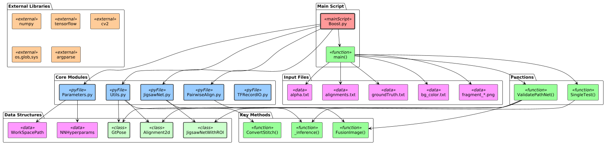

# Indice Completo Diagrammi - Frame Pipeline

## Panoramica

Questo documento fornisce un indice completo di tutti i diagrammi disponibili nel Frame Pipeline, organizzati per categoria e con riferimenti ai documenti che li utilizzano.

## Struttura File Diagrammi

```
docs/
├── diagrams/           # Sorgenti PlantUML (.puml)
│   ├── README.md      # Documentazione diagrammi PlantUML
│   ├── high_level_architetture.puml
│   ├── component_diagram.puml
│   ├── dataflow_architetture.puml
│   ├── dataflow.puml
│   ├── data_transformation.puml
│   ├── sequence_diagram.puml
│   ├── chain_architetture.puml
│   └── new_filters.puml
│
├── img/               # Immagini renderizzate (.png)
│   ├── README.md      # Documentazione immagini
│   ├── high_level_architetture.png
│   ├── component_diagram.png
│   ├── dataflow_architetture.png
│   ├── dataflow.png
│   ├── data_transformation.png
│   ├── sequence_diagram.png
│   ├── chain_architetture.png
│   ├── new_filters.png
│   └── boostdag.png
```

## Categoria: Architettura Sistema

### 1. High Level Architecture
- **Sorgente**: [diagrams/high_level_architetture.puml](diagrams/high_level_architetture.puml)
- **Immagine**: 
- **Utilizzo**: 
  - [01-architecture-overview.md](01-architecture-overview.md#architettura-high-level)
  - [02-configuration-guide.md](02-configuration-guide.md)
  - [05-deployment-guide.md](05-deployment-guide.md)
  - [README.md](README.md#workflow-visuale)
- **Descrizione**: Panoramica completa del sistema con tutti i layer (Input, Processing, Storage, External)

### 2. Component Diagram  
- **Sorgente**: [diagrams/component_diagram.puml](diagrams/component_diagram.puml)
- **Immagine**: 
- **Utilizzo**:
  - [01-architecture-overview.md](01-architecture-overview.md#pipeline-controller)
  - [04-cnn-architecture.md](04-cnn-architecture.md)
  - [05-deployment-guide.md](05-deployment-guide.md)
- **Descrizione**: Diagramma C4 dei componenti software con relazioni e dipendenze

## Categoria: Flusso Dati e Processo

### 3. Data Flow Architecture
- **Sorgente**: [diagrams/dataflow_architetture.puml](diagrams/dataflow_architetture.puml)  
- **Immagine**: 
- **Utilizzo**:
  - [01-architecture-overview.md](01-architecture-overview.md#flusso-di-dati)
  - [03-filters-algorithms.md](03-filters-algorithms.md)
  - [README.md](README.md#workflow-visuale)
- **Descrizione**: Flusso completo dei dati nel sistema con attori, processi e data store

### 4. Core Pipeline Flow
- **Sorgente**: [diagrams/dataflow.puml](diagrams/dataflow.puml)
- **Immagine**:   
- **Utilizzo**:
  - [01-architecture-overview.md](01-architecture-overview.md#core-pipeline-flow)
  - [03-filters-algorithms.md](03-filters-algorithms.md#filtro-1-matlab-filter)
- **Descrizione**: Pipeline step-by-step con input/output dettagliati per ogni fase

### 5. Data Transformations
- **Sorgente**: [diagrams/data_transformation.puml](diagrams/data_transformation.puml)
- **Immagine**: 
- **Utilizzo**:
  - [01-architecture-overview.md](01-architecture-overview.md#data-transformations)
  - [03-filters-algorithms.md](03-filters-algorithms.md)
  - [README.md](README.md#workflow-visuale)
- **Descrizione**: Trasformazioni dei frammenti di immagine attraverso la pipeline

### 6. Sequence Diagram
- **Sorgente**: [diagrams/sequence_diagram.puml](diagrams/sequence_diagram.puml)
- **Immagine**: 
- **Utilizzo**:
  - [01-architecture-overview.md](01-architecture-overview.md#pipeline-execution-sequence)
  - [03-filters-algorithms.md](03-filters-algorithms.md#filtro-1-matlab-filter)
- **Descrizione**: Sequenza temporale di esecuzione con interazione tra componenti

## Categoria: Architettura Filtri

### 7. Filter Chain Architecture  
- **Sorgente**: [diagrams/chain_architetture.puml](diagrams/chain_architetture.puml)
- **Immagine**: 
- **Utilizzo**:
  - [01-architecture-overview.md](01-architecture-overview.md#filter-chain-architecture)
  - [03-filters-algorithms.md](03-filters-algorithms.md#architettura-dei-filtri)
- **Descrizione**: Architettura della catena di filtri con interfacce e implementazioni

### 8. System Extensibility
- **Sorgente**: [diagrams/new_filters.puml](diagrams/new_filters.puml)  
- **Immagine**: 
- **Utilizzo**:
  - [01-architecture-overview.md](01-architecture-overview.md#estensibilità)
- **Descrizione**: Architettura di estensibilità per aggiungere nuovi filtri

## Categoria: CNN e Algoritmi Specializzati

### 9. Boost Filter Detail
- **Sorgente**: N/A (immagine specifica)
- **Immagine**: 
- **Utilizzo**:
  - [04-cnn-architecture.md](04-cnn-architecture.md#overview-dellarchitettura)
- **Descrizione**: Dettaglio architettura del Boost Filter (CNN ensemble)

## Mappe di Utilizzo

### Per Documento

| Documento | Diagrammi Utilizzati | Scopo |
|-----------|---------------------|-------|
| **01-architecture-overview.md** | Tutti | Panoramica completa sistema |
| **02-configuration-guide.md** | High Level, Component | Context per configurazione |
| **03-filters-algorithms.md** | Chain, Dataflow, Sequence, Data Transform | Dettagli implementazione filtri |
| **04-cnn-architecture.md** | Component, Boost Detail | Architettura CNN |
| **05-deployment-guide.md** | High Level, Component, Dataflow | Contesto deployment |
| **README.md** | High Level, Dataflow Arch, Data Transform | Overview e quick start |

### Per Tipo di Utente

| Utente | Diagrammi Chiave | Motivazione |
|--------|-----------------|-------------|
| **Sviluppatori** | Component, Chain, Sequence | Comprensione architettura software |
| **DevOps** | High Level, Component, Dataflow Arch | Deployment e infrastruttura |
| **Data Scientists** | Boost Detail, Data Transform, Dataflow | Ottimizzazione algoritmi |
| **Architetti** | High Level, Component | Design decisioni |
| **Utenti Finali** | Dataflow, Data Transform | Comprensione processo |

## Convenzioni e Standard

### Naming Convention
- **File PlantUML**: `snake_case.puml`
- **Immagini**: `snake_case.png` (stesso nome del sorgente)
- **Titoli**: Descrittivi e coerenti

### Colori e Stili
- **Input Layer**: Light Blue (#lightblue)
- **Processing**: Light Green (#lightgreen)  
- **Storage**: Light Yellow (#lightyellow)
- **External**: Light Coral (#lightcoral)
- **Connessioni**: Nero per chiarezza

### Dimensioni e Formato
- **Formato**: PNG con trasparenza
- **Risoluzione**: Alta qualità per documentazione
- **Dimensioni**: Ottimizzate per visualizzazione web

## Manutenzione e Aggiornamenti

### Workflow di Aggiornamento
1. **Modifica sorgente PlantUML** in `diagrams/`
2. **Rigenera immagine** con `plantuml file.puml -o ../img/`
3. **Verifica rendering** nell'immagine generata
4. **Aggiorna riferimenti** nei documenti se necessario
5. **Test links** nella documentazione

### Comandi Utili
```bash
# Genera tutte le immagini
cd docs/diagrams
plantuml *.puml -o ../img/

# Genera immagine specifica  
plantuml high_level_architetture.puml -o ../img/

# Verifica links documentazione
markdown-link-check docs/*.md
```

## Tool e Risorse

### Rendering Tools
- **VS Code**: PlantUML Extension
- **Online**: [PlantUML Server](http://www.plantuml.com/plantuml/)
- **CLI**: `plantuml` package